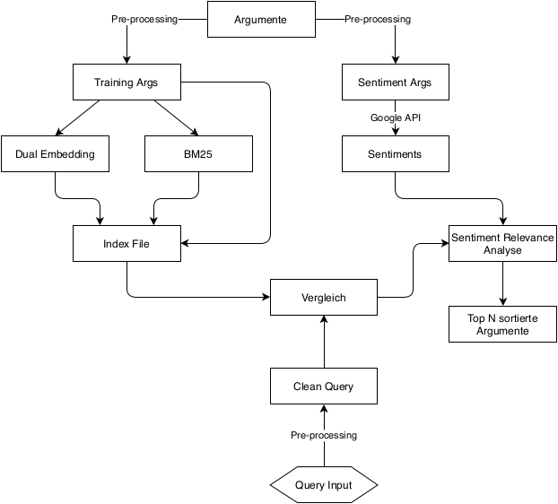

# ArgU

**Argument Retrieval student project at Leipzig University for [Touché @ CLEF 2020](https://touche.webis.de/) - 1st Shared Task on Argument Retrieval.**

You build a system to support users who directly search for arguments, e.g., by supporting their stance, or by aiding them in building a stance on topics of a general societal interest such as abandonment of plastic bottles, animal experiments, abortion, etc. This subtask targets argumentative conversations. You will retrieve documents from the focused crawl with content from online debate portals (idebate.org, debatepedia.org, debatewise.org) and from Reddit's ChangeMyView. Be sure to retrieve good ''strong'' arguments. Our human assessors will label the retrieved documents manually, both for their general topical relevance, and for argument quality dimensions such as: (1) whether an argumentative text is logically cogent, (2) whether it is rhetorically well-written, and (3) whether it contributes to the users' stance-building process, i.e., somewhat similar to the concept of "utility" (refer to this paper for more information on argument quality https://webis.de/downloads/publications/papers/stein_2017c.pdf). Each document will be assigned with a score 0, 1 or 2 for each dimension, where 0 means not relevant/cogent/well-written/utilized, 1 - relevant/cogent/well-written/utilized, and 2 - very relevant/cogent/well-written/utilized. We will use nDCG@5 to evaluate retrieval systems along the four dimensions.

## Prerequisites

1. Download and extract the [Args.me Corpus](https://zenodo.org/record/3274636/files/argsme.zip)
2. Put args-me.json and the topic.xml in your input directory

## Tira Runs

` $ ./tira_run.sh -i $inputDataset -o $outputDir `
	- Docker workflow from below but as a bash script

## Docker

1. ` $ docker build -t argu . `
	- Build the image
2. ` $ docker run --name argu-mongo -p 27017:27017 -d --rm mongo `
	- Starts a MonoDB container
3. ` $ docker run -v <input-dir-path>:/input -v <output-dir-path>:/output --name argu --rm -it --network="host" argu `
	- Runs the container
	- Input directory with args-me.json and topics.xml
	- Output directory will get the results as run.txt
4. ` $ docker stop argu-mongo `
	- Remove MongoDB container

## Command Line

0. ` $ pip install -r requirements.txt `

1. ` $ python argU/preprocessing/mongodb.py -i <input-dir-path> `
	- Create mapping (mongoDB ID <--> argument.id); store into MongoDB
	- Store arguments with the new ID into MongoDB
	- Clean arguments and store as train-arguments into MongoDB
	- Read Sentiments and store into MongoDB
2. ` $ python argU/preprocessing/trec.py -i <input-dir-path> `
	- Create a .trec-file for Terrier (train and queries)
3. ` $ python argU/indexing/a2v.py -f `
	- Generate CBOW
	- Generate argument embeddings and store them into MongoDB
4. Install and run Terrier (see [Dockerfile](Dockerfile))
	- Calculate DPH for queries
	- copy result file in [resources](resources/)
5. ` $ python -m argU -d `
	- Compare given queries with argument embeddings; store Top-N DESM scores into MongoDB
6. ` $ python -m argU -m -o <output-dir-path> `
	- Merge DESM, Terrier and Sentiments to create final scores
  
### Submodul Excecution

* For individual moduls, cd into directory and run ` $ python -m [modulname] `

## Documentation

### (TODO) Report

(Written in German)

### Workflow (Deprecated/TODO)



### (TODO) Evaluation

#### (TODO) Precision

### Modules

* [indexing](argU/indexing/) - Index for DESM scores
* [preprocessing](argU/preprocessing/) - Prework and cleaning of input data
* [sentiment](argU/sentiment/) - Sentiment analysis
* [utils](argU/utils/) - Helper functionalities
* [visualization](argU/visualization/) - Visualization of scores

### Built With

* [Docker](https://www.docker.com/) - Used to build and run
* [gensim](https://radimrehurek.com/gensim/) - Used to generate a Continuous Bag of Words Model 
* [NumPy](https://numpy.org) - Used as a mathematical base to compute vectors and matrices
* [Matplotlib](https://matplotlib.org) - Used to visualize scores
* [Google Cloud Natural Language API](https://cloud.google.com/natural-language/) - Used for sentiment analysis
* [Natural Language Toolkit](https://www.nltk.org) - (Deprecated) Used to train sentiment analysis model
* [MongoDB](https://www.mongodb.com) - Used to store arguments and scores
* [Terrier](http://terrier.org) - Used to calculate DPH scores

## Relevant Information for Subtask (1)

### Task

Decision making processes, be it at the societal or at the personal level, eventually come to a point where one side will challenge the other with a why-question, which is a prompt to justify one’s stance. Thus, technologies for argument mining and argumentation processing are maturing at a rapid pace, giving rise for the first time to argument retrieval. We invite to participate in the first lab on **Argument Retrieval** at CLEF 2020 featuring two subtasks:

(1) retrieval in a focused argument collection to support argumentative conversations.

The **(1) subtask** is motivated by the support of users who search for arguments directly, e.g., by supporting their stance, and targets argumentative conversations. The task is to retrieve arguments from the provided dataset of the focused crawl with content from online debate portals for the 50 given topics, covering a wide range of controversial issues. 

### Data

Argument topics for subtask (1) and comparative questions for subtask (2) will be send to each team via email upon completed registration. The topics will be provided as XML files.

Example topic for **subtask (1)**:

   <topic>
      <num>1</num>
      <title>Is climate change real?</title>
      <description>You read an opinion piece on how climate change is a hoax and disagree. Now you are looking for arguments supporting the claim that climate change is in fact real.</description>
      <narrative>Relevant arguments will support the given stance that climate change is real or attack a hoax side's argument.</narrative>
   </topic>

**Document collections.** To search for relevant arguments, you can use your own index based on the dataset args-me or for simplicity deploy an API of the search engine args.me.

### Runs Submission

We encourage participants to use TIRA for their submissions to increase replicability of the experiments. We provide a dedicated TIRA tutorial for Touché and are available to walk you through. You can also submit runs per email. In both cases, we will review your submission promptly and provide feedback.

Runs may be either automatic or manual. An automatic run is made without any manual manipulation of the given topic titles. Your run is automatic if you do not use description and narrative for developing approaches. A manual run is anything that is not an automatic run. Please let us know which of your runs are manual upon submission.

The submission format for both tasks will follow the standard TREC format:

`qid Q0 doc rank score tag`

With:

* qid: The topic number.
* Q0: Unused, should always be Q0.
* doc: The document id returned by your system for the topic qid:
	* For **subtask (1)**: Use the official args-me id.
* rank: The rank the document is retrieved at.
* score: The score (integer or floating point) that generated the ranking. The score must be in descending (non-increasing) order. It is important to handle tied scores. (trec_eval sorts documents by the score values and not your rank values.)
* tag: A tag that identifies your group and the method you used to produce the run.

The fields should be spectated with a whitespace. The width of the columns in the format is not important, but it is important to include all columns and have some amount of white space between the columns.

An example run for task 1 is:
```
1 Q0 10113b57-2019-04-18T17:05:08Z-00001-000 1 17.89 myGroupMyMethod
1 Q0 100531be-2019-04-18T19:18:31Z-00000-000 2 16.43 myGroupMyMethod
1 Q0 10006689-2019-04-18T18:27:51Z-00000-000 3 16.42 myGroupMyMethod
...
```

### Material
* Literature: [Ajjour et al. 2019](https://webis.de/downloads/publications/papers/stein_2019o.pdf), [Wachsmuth et al. 2017](https://webis.de/downloads/publications/papers/stein_2017r.pdf), [Potthast et al. 2019](https://webis.de/downloads/publications/papers/stein_2019j.pdf)
* Dataset: [Args.me Corpus](https://zenodo.org/record/3274636#.XeAyUi03v4a)
* Evaluation: [Topics Queries XML](/topics.xml)
